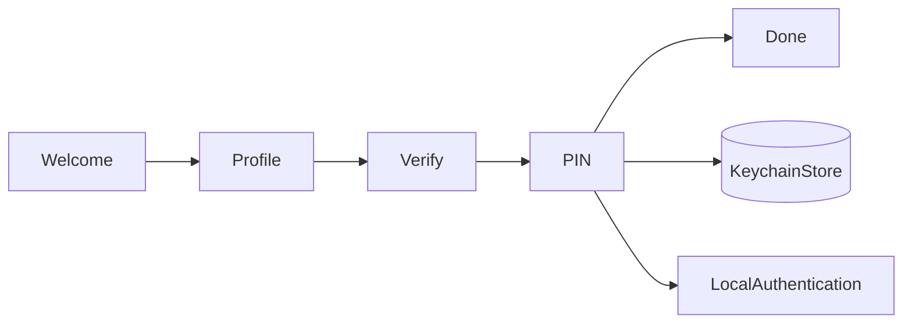

# VaultFlow


Step-driven onboarding with a small **Flow** state machine, **Keychain** PIN storage, and **LocalAuthentication** biometrics — modeled after neobank signup patterns.

## Highlights

| Area | Implementation |
|------|----------------|
| **Flow** | `OnboardingState` + `OnboardingStep` state machine |
| **Security** | Keychain PIN (`kSecAttrAccessibleWhenUnlockedThisDeviceOnly`) |
| **Biometrics** | Face ID / Touch ID on PIN step |
| **UI** | SwiftUI, dark fintech theme |

## Flow navigation

| Step | Purpose |
|------|---------|
| `welcome` | Intro |
| `profile` | Collect display name |
| `verify` | Mock KYC checkpoint |
| `pin` | 4-digit PIN → Keychain |
| `done` | Card-ready state |

State advances via `OnboardingState`; the PIN step persists to `KeychainStore` before biometrics or completion.

## Architecture



## Screenshots

Replace `docs/screenshots/onboarding.png` with a real capture (see [docs/screenshots/README.md](docs/screenshots/README.md)).

| Onboarding flow |
|---|
|  |

**Screen recordings:** Simulator → **Record Screen**.

## Build & run

```bash
xcodegen generate
open VaultFlow.xcodeproj
# iPhone simulator → ⌘R
```

CI: `xcodebuild -project VaultFlow.xcodeproj -scheme VaultFlow -destination 'generic/platform=iOS Simulator' CODE_SIGNING_ALLOWED=NO build`

Tests: ⌘U (includes Keychain round-trip).

## Revolut-relevant signals

- Flow/state-machine onboarding (Revolut Flow–inspired)
- Secrets not stored in `UserDefaults`
- Biometric unlock path
- Device-only Keychain accessibility flags

*Fintech-inspired — not affiliated with Revolut Ltd.*
